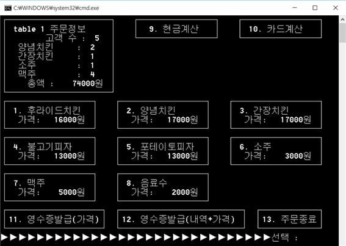

레스토랑 경영을 위한 POS시스템
============
>학과 수업인 소프트웨어프로젝트의 첫번째 과제로 CLI환경에서 사용하는 POS시스템을 개발하였다.

개발 기간 및 환경
-------------
* 기간 : 2015.9 ~ 2015.10
* OS : window 10
* Language : C
* Tools : Visual Studio 2013

개발 내용
-------------
* 테이블 별로 주문한 음식을 기록한다.
* 메뉴별 단가와 수량이 기록되어야 한다.
* 고객의 요구에 따라 메뉴가 모두 기록된 영수증과 총액만 기록된 영수증이 출력 가능해야 한다.
* 고객이 지불한 액수에 따라 거스름돈을 계산해 주어야 한다.(현금, 카드 등 선 택 기능 포함)
* 전체 매출액, 메뉴별 매출액, 메뉴별 주문 수 등 통계 기능이 있어야 한다.

실행 화면
-------------
